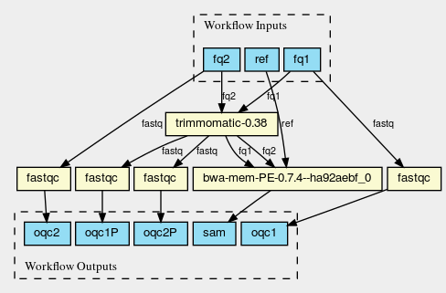

# CWL-workflows
Workflows written in common workflow language (CWL)

NOTE: this branch of the repository contains the workflow as described
in the reproducible
[WORKFLOW](https://gitlab.com/pjotrp/guix-notes/blob/master/WORKFLOW.org)
example (using GNU Guix, IPFS and CWL).

See

(CWL Viewer https://view.commonwl.org)
